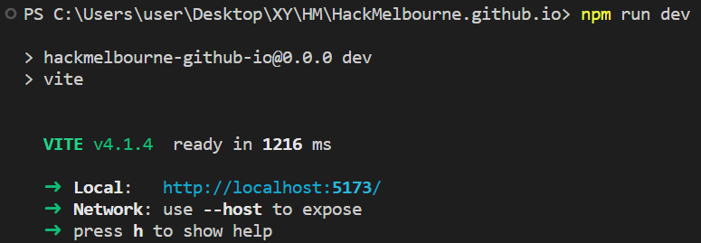

## Getting Startsd
1. Clone the repository
2. Once you've cloned the repo, run `npm install` to install all of the node_modules
    ```
    npm install
    ```
3. To run the development server, run `npm run dev`
    ```
    npm run dev
    ```
    * 

### Developing MelbourneHack2023
* The Melbourne Hack website is in `/melbournehack`
* Main source is in [`./src/hackathonWebsites/MelbourneHack/2023/index.jsx`](./src/hackathonWebsites/MelbourneHack/2023/index.jsx)